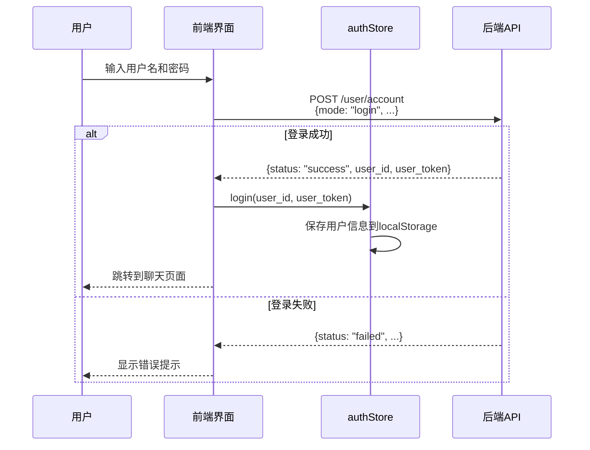
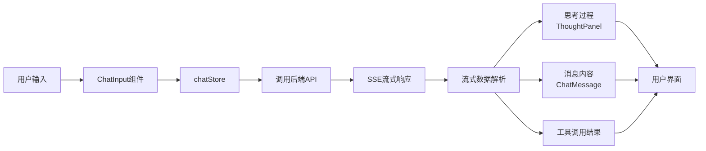
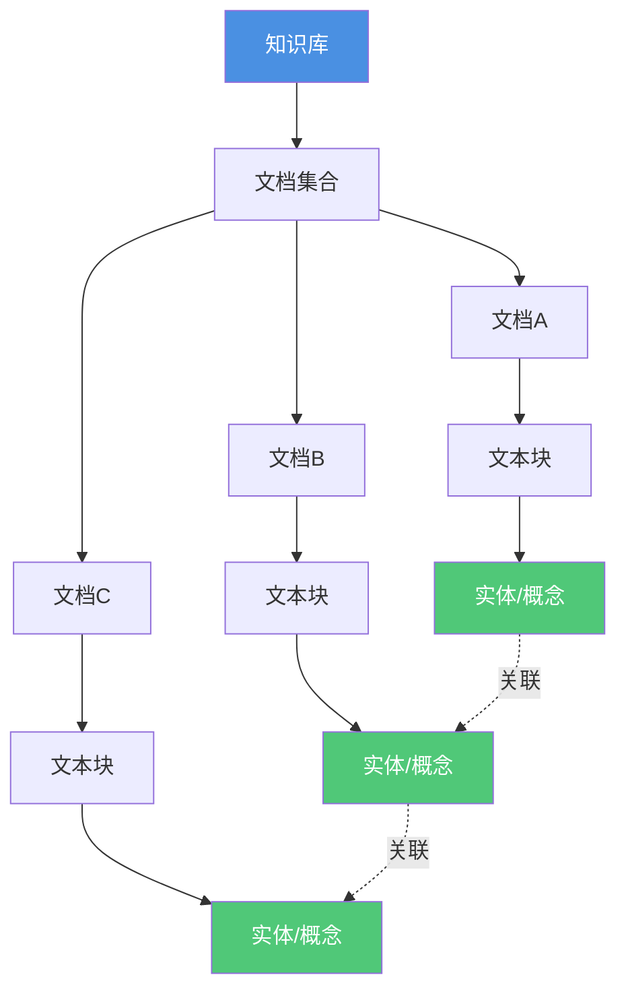
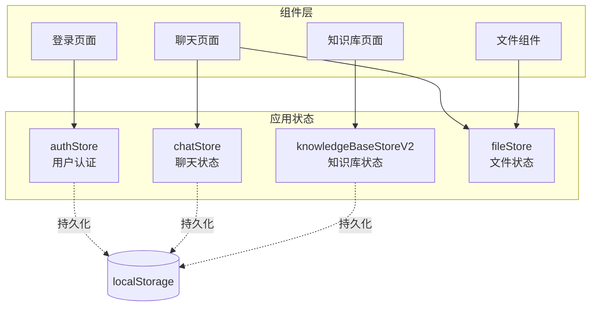

# OpenMonica Frontend - AI Agent 交互控制中心

**对标Monica的用户体验** - 流畅、美观、高效的AI助手交互界面

## 📋 目录

- [项目概述](#项目概述)
- [技术栈](#技术栈)
- [项目结构](#项目结构)
- [主要功能](#主要功能)
- [快速开始](#快速开始)
- [开发指南](#开发指南)
- [组件文档](#组件文档)
- [状态管理](#状态管理)
- [API集成](#api集成)
- [部署指南](#部署指南)
- [故障排除](#故障排除)

---

## 项目概述

**OpenMonica_frontend** 是OpenMonica AI Agent平台的**用户交互界面**，为用户提供与AI助手对话、管理知识库、查看Agent工作过程的直观控制中心。它不仅仅是一个聊天界面，而是一个**完整的AI Agent操作台**。

**核心定位**：
- 🎨 **Monica级用户体验** - 流畅的流式对话、优雅的UI设计、快速响应
- 🤖 **Agent透明化** - 实时展示AI的思考过程、工具调用、任务执行步骤
- 📱 **跨平台部署** - 当前为Web应用，未来扩展至浏览器扩展、桌面应用、移动端
- 🔧 **完整控制** - 知识库管理、模型切换、工具配置、个性化设置一站式完成

### ✨ 核心特性

- **🎨 现代化UI**：基于 Ant Design 5 + Tailwind CSS，提供美观且响应式的用户界面
- **⚡ 快速构建**：使用 Vite 构建工具，支持热模块替换（HMR），开发体验优秀
- **🔒 类型安全**：完整的 TypeScript 类型定义，减少运行时错误
- **📦 轻量状态管理**：使用 Zustand，简单高效的状态管理方案
- **🔄 实时通信**：支持 SSE（Server-Sent Events）流式数据传输
- **📱 响应式设计**：适配各种屏幕尺寸，移动端友好
- **🧩 组件化架构**：模块化、可复用的组件设计

### 🎯 主要功能

| 功能模块 | 描述 |
|----------|------|
| **智能对话** | 支持流式响应、工具调用、多模型选择、思考过程展示 |
| **知识库管理** | 文档上传、知识图谱可视化、智能搜索 |
| **文件处理** | 多格式文件上传、预览、分类管理 |
| **用户认证** | 安全的登录注册、会话管理、Token认证 |
| **个性化定制** | 用户提示词、模型记忆、偏好设置 |
| **组织管理** | 团队协作、权限管理 |
| **助手训练** | 自定义助手行为、训练数据管理 |

---

## 技术栈

### 核心框架

| 技术 | 版本 | 用途 |
|------|------|------|
| **React** | 18.3.1 | 核心UI框架，支持并发特性 |
| **TypeScript** | 5.7.3 | 静态类型检查，提升开发体验 |
| **Vite** | 6.0.7 | 快速构建工具，支持HMR |

### UI组件库

| 技术 | 版本 | 用途 |
|------|------|------|
| **Ant Design** | 5.26.2 | 企业级UI组件库 |
| **Tailwind CSS** | 3.4.17 | 原子化CSS框架 |
| **@ant-design/icons** | 5.6.1 | Ant Design图标库 |

### 状态管理与数据获取

| 技术 | 版本 | 用途 |
|------|------|------|
| **Zustand** | 4.5.7 | 轻量级状态管理 |
| **TanStack Query** | 4.40.0 | 强大的数据获取和缓存库 |

### 路由与HTTP

| 技术 | 版本 | 用途 |
|------|------|------|
| **React Router DOM** | 6.30.1 | 客户端路由 |
| **Axios** | 1.10.0 | HTTP客户端 |

### 可视化与工具

| 技术 | 版本 | 用途 |
|------|------|------|
| **D3.js** | 7.9.0 | 数据可视化（知识图谱） |
| **Mermaid** | 8.14.0 | 流程图渲染 |
| **Markdown-it** | 13.0.2 | Markdown渲染 |
| **Highlight.js** | 11.9.0 | 代码高亮 |
| **js-yaml** | 4.1.0 | YAML解析 |

---

## 项目结构

```
OpenMonica_frontend/
├── public/                          # 静态资源
│   ├── config.yaml                  # 前端配置文件
│   └── assets/                      # 图片、字体等
│
├── src/                             # 源代码目录
│   ├── main.tsx                     # React应用入口
│   ├── App.tsx                      # 主应用组件
│   │
│   ├── pages/                       # 页面组件
│   │   ├── AuthPage.tsx             # 登录/注册页面
│   │   ├── ChatPage.tsx             # 聊天页面
│   │   ├── KnowledgeBasePageV2.tsx  # 知识库管理页面
│   │   ├── CustomPage.tsx           # 个性化设置页面
│   │   ├── SettingsPage.tsx         # 系统设置页面
│   │   ├── HelpPage.tsx             # 帮助页面
│   │   ├── OrganizationPage.tsx     # 组织管理页面
│   │   └── AssistantTrainingPage.tsx # 助手训练页面
│   │
│   ├── components/                  # 可复用组件
│   │   ├── layout/                  # 布局组件
│   │   │   └── MainLayout.tsx       # 主布局（侧边栏+顶栏+内容区）
│   │   ├── chat/                    # 聊天相关组件
│   │   │   ├── ChatMessage.tsx      # 聊天消息组件
│   │   │   ├── ChatInput.tsx        # 聊天输入框
│   │   │   ├── ChatMessageList.tsx  # 消息列表
│   │   │   ├── ThoughtPanel.tsx     # 思考过程面板
│   │   │   └── KnowledgeSourceSelect.tsx # 知识源选择
│   │   ├── knowledgebase_v2/        # 知识库组件
│   │   │   ├── KBListPanel.tsx      # 知识库列表面板
│   │   │   ├── KBDetail.tsx         # 知识库详情
│   │   │   ├── KBDetailHeader.tsx   # 知识库详情头部
│   │   │   ├── KBGraphView.tsx      # 知识图谱可视化
│   │   │   └── KBCreateEditModal.tsx # 创建/编辑知识库模态框
│   │   ├── file/                    # 文件管理组件
│   │   │   ├── FileUpload.tsx       # 文件上传组件
│   │   │   ├── FileAttachmentList.tsx # 文件附件列表
│   │   │   └── AttachmentToggle.tsx # 附件切换开关
│   │   └── custom/                  # 自定义组件
│   │       └── CustomEditorSection.tsx # 个性化编辑区
│   │
│   ├── stores/                      # Zustand状态管理
│   │   ├── authStore.ts             # 用户认证状态
│   │   ├── chatStore.ts             # 聊天状态
│   │   ├── knowledgeBaseStore.ts    # 知识库状态（旧版）
│   │   ├── knowledgeBaseStoreV2.ts  # 知识库状态（新版）
│   │   └── fileStore.ts             # 文件管理状态
│   │
│   ├── hooks/                       # 自定义React Hooks
│   │   ├── useAuth.ts               # 认证相关hooks
│   │   └── useApi.ts                # API相关hooks
│   │
│   ├── utils/                       # 工具函数
│   │   ├── api.ts                   # API工具（认证请求）
│   │   ├── streamingUtils.ts        # 流式数据处理
│   │   ├── configLoader.ts          # 配置加载器
│   │   ├── fileManagementApi.ts     # 文件管理API
│   │   ├── knowledgeBaseApi.ts      # 知识库API
│   │   ├── knowledgeGraphApi.ts     # 知识图谱API
│   │   └── parseAttachments.ts      # 附件解析工具
│   │
│   ├── context/                     # React Context
│   │   └── SidebarContext.tsx       # 侧边栏上下文
│   │
│   ├── types/                       # TypeScript类型定义
│   │   ├── knowledgeBase.ts         # 知识库类型
│   │   ├── mermaid.d.ts             # Mermaid类型声明
│   │   ├── speech.d.ts              # 语音识别类型声明
│   │   └── js-yaml.d.ts             # YAML类型声明
│   │
│   └── test-samples/                # 测试示例
│       ├── ReactAppTest.tsx         # React应用测试
│       └── LoginAndChatVerification.tsx # 登录和聊天验证测试
│
├── server.cjs                       # Express代理服务器
├── package.json                     # 项目配置
├── vite.config.js                   # Vite配置
├── tsconfig.json                    # TypeScript配置
├── tailwind.config.js               # Tailwind CSS配置
├── postcss.config.js                # PostCSS配置
└── README.md                        # 项目说明
```

---

## 主要功能

### 1. 用户认证



**主要功能**：
- ✅ 用户登录/注册
- ✅ Token认证
- ✅ 会话持久化（localStorage）
- ✅ 自动重定向（未登录跳转到登录页）
- ✅ 认证失败自动登出

**相关文件**：
- `src/pages/AuthPage.tsx` - 登录/注册页面
- `src/stores/authStore.ts` - 认证状态管理
- `src/hooks/useAuth.ts` - 认证hooks
- `src/utils/api.ts` - 认证API工具

### 2. 智能对话



**主要功能**：
- ✅ **流式响应**：实时显示模型输出
- ✅ **思考过程展示**：显示推理模型的内部思考（如DeepSeek-R1）
- ✅ **工具调用可视化**：显示工具调用过程和结果
- ✅ **多模型选择**：支持切换不同的LLM模型
- ✅ **多模态输入**：支持文本+图片混合输入
- ✅ **会话管理**：创建、切换、删除聊天会话
- ✅ **历史记录**：自动保存对话历史
- ✅ **Markdown渲染**：支持Markdown格式，包括代码高亮
- ✅ **Mermaid图表**：自动渲染Mermaid流程图

**相关文件**：
- `src/pages/ChatPage.tsx` - 聊天页面主组件
- `src/components/chat/ChatMessageList.tsx` - 消息列表
- `src/components/chat/ChatMessage.tsx` - 单条消息展示
- `src/components/chat/ChatInput.tsx` - 消息输入框
- `src/components/chat/ThoughtPanel.tsx` - 思考过程面板
- `src/stores/chatStore.ts` - 聊天状态管理
- `src/utils/streamingUtils.ts` - SSE流式处理工具

**流式响应处理示例**：

```typescript
// src/utils/streamingUtils.ts

export async function* parseSSEStream(response: Response): AsyncGenerator<SSEChunk> {
  const reader = response.body?.getReader()
  const decoder = new TextDecoder()
  let buffer = ''

  while (true) {
    const { value, done } = await reader!.read()
    if (done) break

    buffer += decoder.decode(value, { stream: true })
    const lines = buffer.split('\n')
    buffer = lines.pop() || ''

    for (const line of lines) {
      if (line.startsWith('data: ')) {
        const data = line.slice(6)
        if (data === '[DONE]') {
          return
        }

        try {
          const parsed = JSON.parse(data)
          yield parsed
        } catch (e) {
          console.warn('Failed to parse SSE data:', data)
        }
      }
    }
  }
}
```

### 3. 知识库管理

**主要功能**：
- ✅ **知识库CRUD**：创建、查看、编辑、删除知识库
- ✅ **文档上传**：支持多种格式文档上传（PDF、Word、TXT等）
- ✅ **文档预览**：在线预览PDF文档
- ✅ **知识图谱可视化**：使用D3.js可视化知识关系
- ✅ **文档搜索**：快速搜索知识库内的文档
- ✅ **OCR处理**：可选OCR模式（simple/normal）
- ✅ **批量操作**：批量上传、删除文档

**知识图谱可视化**：



**相关文件**：
- `src/pages/KnowledgeBasePageV2.tsx` - 知识库管理页面
- `src/components/knowledgebase_v2/KBListPanel.tsx` - 知识库列表
- `src/components/knowledgebase_v2/KBDetail.tsx` - 知识库详情
- `src/components/knowledgebase_v2/KBGraphView.tsx` - 知识图谱可视化
- `src/stores/knowledgeBaseStoreV2.ts` - 知识库状态管理
- `src/utils/knowledgeBaseApi.ts` - 知识库API
- `src/utils/knowledgeGraphApi.ts` - 知识图谱API

### 4. 文件管理

**主要功能**：
- ✅ **文件上传**：拖拽上传、点击上传
- ✅ **文件预览**：支持图片预览
- ✅ **附件管理**：聊天中的文件附件管理
- ✅ **格式支持**：支持多种文件格式

**相关文件**：
- `src/components/file/FileUpload.tsx` - 文件上传组件
- `src/components/file/FileAttachmentList.tsx` - 附件列表
- `src/stores/fileStore.ts` - 文件状态管理
- `src/utils/fileManagementApi.ts` - 文件管理API

### 5. 个性化定制

**主要功能**：
- ✅ **用户提示词**：自定义系统提示词
- ✅ **模型记忆**：保存用户偏好和上下文
- ✅ **工具选择**：选择可用的工具集合

**相关文件**：
- `src/pages/CustomPage.tsx` - 个性化设置页面
- `src/components/custom/CustomEditorSection.tsx` - 编辑区组件

---

## 快速开始

### 📦 环境要求

- **Node.js** ≥ 20.14.0 (推荐使用LTS版本)
- **npm** ≥ 9.0.0 或 **yarn** ≥ 1.22.0
- **现代浏览器**：Chrome 90+、Firefox 88+、Safari 14+、Edge 90+

### 🚀 安装依赖

#### 方式一：使用npm

```bash
cd modules/OpenMonica_frontend
npm install
```

#### 方式二：使用yarn

```bash
cd modules/OpenMonica_frontend
yarn install
```

### ⚙️ 配置文件

创建 `public/config.yaml`（参考 `public/config.example.yaml`）：

```yaml
# 后端API配置
api:
  base_url: "http://localhost:8030"          # 主服务API地址
  user_management_url: "http://localhost:8088" # 用户管理服务地址
  file_server_url: "http://localhost:8087"   # 文件服务地址

# 前端配置
frontend:
  title: "OpenMonica"
  description: "AI知识问答助手"
  logo_url: "/assets/logo.png"

# 功能开关
features:
  enable_voice_input: true     # 语音输入
  enable_thought_panel: true   # 思考过程面板
  enable_knowledge_graph: true # 知识图谱
  enable_file_upload: true     # 文件上传
```

### 🎬 启动开发服务器

```bash
# 启动Vite开发服务器
npm run dev

# 或使用yarn
yarn dev
```

**访问地址**：`http://localhost:5173`

### 🏗️ 构建生产版本

```bash
# 构建生产版本
npm run build

# 预览构建结果
npm run preview
```

**构建输出**：`dist/` 目录

---

## 开发指南

### 📁 添加新页面

#### 步骤1：创建页面组件

在 `src/pages/` 目录下创建新文件，例如 `NewFeaturePage.tsx`：

```typescript
import React from 'react'
import { Typography } from 'antd'

const { Title, Paragraph } = Typography

const NewFeaturePage: React.FC = () => {
  return (
    <div className="p-6">
      <Title level={2}>新功能页面</Title>
      <Paragraph>
        这是一个新功能页面的示例。
      </Paragraph>
    </div>
  )
}

export default NewFeaturePage
```

#### 步骤2：添加路由

在 `src/App.tsx` 中添加路由：

```typescript
import NewFeaturePage from './pages/NewFeaturePage'

// ...在Routes中添加
<Route path="/new-feature" element={<NewFeaturePage />} />
```

#### 步骤3：添加导航

在 `src/components/layout/MainLayout.tsx` 中添加侧边栏导航项：

```typescript
{
  key: 'new-feature',
  icon: <RocketOutlined />,
  label: '新功能',
  onClick: () => navigate('/new-feature')
}
```

### 🧩 创建新组件

#### 步骤1：创建组件文件

在 `src/components/` 下创建新组件，例如 `MyComponent.tsx`：

```typescript
import React from 'react'

interface MyComponentProps {
  title: string
  content: string
  onClick?: () => void
}

const MyComponent: React.FC<MyComponentProps> = ({ title, content, onClick }) => {
  return (
    <div className="p-4 bg-white rounded-lg shadow">
      <h3 className="text-lg font-bold mb-2">{title}</h3>
      <p className="text-gray-600">{content}</p>
      {onClick && (
        <button
          onClick={onClick}
          className="mt-2 px-4 py-2 bg-blue-500 text-white rounded hover:bg-blue-600"
        >
          点击我
        </button>
      )}
    </div>
  )
}

export default MyComponent
```

#### 步骤2：使用组件

```typescript
import MyComponent from '../components/MyComponent'

<MyComponent
  title="示例标题"
  content="示例内容"
  onClick={() => console.log('按钮被点击')}
/>
```

### 📊 添加新的状态管理

#### 步骤1：创建Store

在 `src/stores/` 下创建新store，例如 `myFeatureStore.ts`：

```typescript
import { create } from 'zustand'
import { persist } from 'zustand/middleware'

interface MyFeatureState {
  data: any[]
  isLoading: boolean
  error: string | null

  // Actions
  fetchData: () => Promise<void>
  setData: (data: any[]) => void
  setLoading: (loading: boolean) => void
  setError: (error: string | null) => void
}

export const useMyFeatureStore = create<MyFeatureState>()(
  persist(
    (set, get) => ({
      data: [],
      isLoading: false,
      error: null,

      fetchData: async () => {
        set({ isLoading: true, error: null })
        try {
          const response = await fetch('/api/my-feature')
          const data = await response.json()
          set({ data, isLoading: false })
        } catch (error) {
          set({ error: (error as Error).message, isLoading: false })
        }
      },

      setData: (data) => set({ data }),
      setLoading: (loading) => set({ isLoading: loading }),
      setError: (error) => set({ error })
    }),
    {
      name: 'my-feature-storage', // localStorage key
      partialize: (state) => ({ data: state.data }) // 只持久化data字段
    }
  )
)
```

#### 步骤2：在组件中使用Store

```typescript
import { useMyFeatureStore } from '../stores/myFeatureStore'

const MyComponent: React.FC = () => {
  const { data, isLoading, error, fetchData } = useMyFeatureStore()

  React.useEffect(() => {
    fetchData()
  }, [])

  if (isLoading) return <div>加载中...</div>
  if (error) return <div>错误: {error}</div>

  return (
    <div>
      {data.map(item => (
        <div key={item.id}>{item.name}</div>
      ))}
    </div>
  )
}
```

### 🔌 集成新API

#### 步骤1：定义API函数

在 `src/utils/` 下创建API文件，例如 `myFeatureApi.ts`：

```typescript
import { authenticatedFetch, createAuthHeaders } from './api'

export interface MyFeatureItem {
  id: string
  name: string
  description: string
}

/**
 * 获取功能列表
 */
export async function getMyFeatureList(): Promise<MyFeatureItem[]> {
  const response = await authenticatedFetch('/api/my-feature/list')
  const data = await response.json()
  return data.items
}

/**
 * 创建新项
 */
export async function createMyFeatureItem(item: Omit<MyFeatureItem, 'id'>): Promise<MyFeatureItem> {
  const response = await authenticatedFetch('/api/my-feature/create', {
    method: 'POST',
    body: JSON.stringify(item)
  })
  return await response.json()
}

/**
 * 删除项
 */
export async function deleteMyFeatureItem(id: string): Promise<void> {
  await authenticatedFetch(`/api/my-feature/delete/${id}`, {
    method: 'DELETE'
  })
}
```

#### 步骤2：在组件中使用API

```typescript
import { getMyFeatureList, createMyFeatureItem } from '../utils/myFeatureApi'

const MyComponent: React.FC = () => {
  const [items, setItems] = React.useState<MyFeatureItem[]>([])

  React.useEffect(() => {
    async function loadData() {
      const data = await getMyFeatureList()
      setItems(data)
    }
    loadData()
  }, [])

  const handleCreate = async () => {
    const newItem = await createMyFeatureItem({
      name: '新项目',
      description: '描述'
    })
    setItems([...items, newItem])
  }

  return (
    <div>
      <button onClick={handleCreate}>创建新项</button>
      {items.map(item => (
        <div key={item.id}>{item.name}</div>
      ))}
    </div>
  )
}
```

---

## 组件文档

### 核心组件

#### 1. MainLayout

**文件**：`src/components/layout/MainLayout.tsx`

**功能**：主布局组件，包含侧边栏、顶栏、内容区

**Props**：
```typescript
interface MainLayoutProps {
  children: React.ReactNode
}
```

**使用示例**：
```typescript
<MainLayout>
  <YourPageComponent />
</MainLayout>
```

#### 2. ChatMessage

**文件**：`src/components/chat/ChatMessage.tsx`

**功能**：展示单条聊天消息，支持Markdown渲染、代码高亮、Mermaid图表

**Props**：
```typescript
interface ChatMessageProps {
  message: ChatMessage
  showThinking?: boolean  // 是否显示思考过程
}

interface ChatMessage {
  key: string
  chat_id?: string
  role: 'user' | 'assistant' | 'system'
  content: string | any[]
  timestamp: string
  streaming?: boolean
  reasoning_content?: string  // 思考内容
}
```

**特性**：
- ✅ Markdown自动渲染
- ✅ 代码高亮（Highlight.js）
- ✅ Mermaid流程图自动渲染
- ✅ 思考过程折叠/展开
- ✅ 流式内容实时更新

#### 3. ChatInput

**文件**：`src/components/chat/ChatInput.tsx`

**功能**：聊天输入框，支持文本输入、文件上传、模型选择

**Props**：
```typescript
interface ChatInputProps {
  onSendMessage: (content: string | any[]) => void
  disabled?: boolean
  placeholder?: string
}
```

**特性**：
- ✅ 多行文本输入
- ✅ 快捷键支持（Enter发送，Shift+Enter换行）
- ✅ 文件上传（图片、文档）
- ✅ 模型选择下拉框
- ✅ 提示词模板选择

#### 4. KBGraphView

**文件**：`src/components/knowledgebase_v2/KBGraphView.tsx`

**功能**：知识图谱可视化组件，使用D3.js渲染

**Props**：
```typescript
interface KBGraphViewProps {
  knowledgeBaseId: string
  width?: number
  height?: number
}
```

**特性**：
- ✅ 力导向图布局
- ✅ 节点拖拽
- ✅ 缩放和平移
- ✅ 节点点击交互
- ✅ 关系边渲染

---

## 状态管理

### Zustand Store架构



### authStore

**文件**：`src/stores/authStore.ts`

**状态**：
```typescript
interface AuthState {
  user: User | null           // 当前用户
  isAuthenticated: boolean    // 是否已认证
  token: string | null        // 认证Token

  // Actions
  login: (userId: string, token: string) => Promise<void>
  logout: () => void
  updateUser: (user: User) => void
}
```

**持久化**：保存在 `localStorage` 的 `auth-storage` key

### chatStore

**文件**：`src/stores/chatStore.ts`

**状态**：
```typescript
interface ChatState {
  currentSessionId: string | null    // 当前会话ID
  currentMessages: ChatMessage[]     // 当前会话消息列表
  streamingMessage: ChatMessage | null // 流式消息
  chatSessions: ChatSession[]        // 会话列表
  toolCalls: Record<string, ToolCall> // 工具调用记录
  selectedModelIds: string[]         // 选择的模型ID
  isLoading: boolean
  error: string | null

  // Actions
  setCurrentSession: (sessionId: string) => void
  addUserMessage: (content: string | any[]) => void
  startStreamingResponse: (chatId?: string) => void
  updateStreamingContent: (content?: string, reasoningContent?: string) => void
  finishStreamingResponse: () => void
  clearCurrentChat: () => void
  // ... 更多actions
}
```

**持久化**：保存在 `localStorage` 的 `chat-storage` key

### knowledgeBaseStoreV2

**文件**：`src/stores/knowledgeBaseStoreV2.ts`

**状态**：
```typescript
interface KnowledgeBaseState {
  knowledgeBases: KnowledgeBase[]    // 知识库列表
  currentKB: KnowledgeBase | null    // 当前选中的知识库
  documents: Document[]              // 文档列表
  isLoading: boolean
  error: string | null

  // Actions
  fetchKnowledgeBases: () => Promise<void>
  createKnowledgeBase: (kb: CreateKBInput) => Promise<void>
  updateKnowledgeBase: (id: string, updates: Partial<KnowledgeBase>) => Promise<void>
  deleteKnowledgeBase: (id: string) => Promise<void>
  fetchDocuments: (kbId: string) => Promise<void>
  uploadDocument: (kbId: string, file: File, mode: 'simple' | 'normal') => Promise<void>
  // ... 更多actions
}
```

---

## API集成

### 后端API端点

| 模块 | 端点 | 说明 |
|------|------|------|
| **用户管理** | `http://localhost:8088` | 用户认证、账户管理、知识库CRUD |
| **文件服务** | `http://localhost:8087` | 文件上传、OCR处理、文档管理 |
| **问答服务** | `http://localhost:8030` | LLM对话、工具调用、流式响应 |

### API调用示例

#### 1. 用户登录

```typescript
// POST /user/account
const response = await fetch('http://localhost:8088/user/account', {
  method: 'POST',
  headers: { 'Content-Type': 'application/x-www-form-urlencoded' },
  body: new URLSearchParams({
    mode: 'login',
    user_id: 'username',
    user_password: 'password'
  })
})

const data = await response.json()
// { status: "success", user_id: "...", user_token: "..." }
```

#### 2. 聊天对话（SSE流式）

```typescript
// POST /v1/chat/completions (SSE流式)
const response = await fetch('http://localhost:8030/v1/chat/completions', {
  method: 'POST',
  headers: { 'Content-Type': 'application/x-www-form-urlencoded' },
  body: new URLSearchParams({
    user_id: 'user123@session456',
    model: 'gpt-4',
    messages: JSON.stringify([
      { role: 'user', content: '你好' }
    ])
  })
})

// 解析SSE流
const reader = response.body!.getReader()
const decoder = new TextDecoder()

while (true) {
  const { value, done } = await reader.read()
  if (done) break

  const text = decoder.decode(value)
  const lines = text.split('\n')

  for (const line of lines) {
    if (line.startswith('data: ')) {
      const data = line.slice(6)
      if (data === '[DONE]') {
        // 流结束
      } else {
        const chunk = JSON.parse(data)
        const content = chunk.choices[0].delta.content
        // 处理content
      }
    }
  }
}
```

#### 3. 文件上传

```typescript
// POST /process
const formData = new FormData()
formData.append('user_id', 'user123')
formData.append('knowledge_base_id', 'kb_456')
formData.append('file_url', fileUrl)
formData.append('mode', 'normal') // 或 'simple'

const response = await fetch('http://localhost:8087/process', {
  method: 'POST',
  body: formData
})

const result = await response.json()
// { status: "success", document_id: "..." }
```

---

## 部署指南

### 🚀 开发环境部署

#### 方式一：本地开发服务器

```bash
# 安装依赖
npm install

# 启动开发服务器
npm run dev

# 访问 http://localhost:5173
```

#### 方式二：Express代理服务器

```bash
# 启动Express服务器（用于API代理）
npm start

# 访问 http://localhost:3000
```

### 📦 生产环境部署

#### 步骤1：构建生产版本

```bash
# 构建
npm run build

# 构建输出在 dist/ 目录
```

#### 步骤2：部署到静态服务器

**Nginx配置示例**：

```nginx
server {
    listen 80;
    server_name your-domain.com;
    root /path/to/dist;

    # 启用gzip压缩
    gzip on;
    gzip_types text/plain text/css application/json application/javascript text/xml application/xml application/xml+rss text/javascript;

    location / {
        try_files $uri $uri/ /index.html;
    }

    # API代理（避免CORS）
    location /api/ {
        proxy_pass http://localhost:8030/;
        proxy_http_version 1.1;
        proxy_set_header Upgrade $http_upgrade;
        proxy_set_header Connection 'upgrade';
        proxy_set_header Host $host;
        proxy_cache_bypass $http_upgrade;
    }

    location /user/ {
        proxy_pass http://localhost:8088/user/;
        proxy_http_version 1.1;
        proxy_set_header Host $host;
    }

    location /file/ {
        proxy_pass http://localhost:8087/;
        proxy_http_version 1.1;
        proxy_set_header Host $host;
    }
}
```

#### 步骤3：Docker部署

**Dockerfile**：

```dockerfile
# 构建阶段
FROM node:20-alpine AS builder

WORKDIR /app

# 复制依赖文件
COPY package*.json ./
RUN npm ci

# 复制源代码
COPY . .

# 构建生产版本
RUN npm run build

# 生产阶段
FROM nginx:alpine

# 复制构建结果
COPY --from=builder /app/dist /usr/share/nginx/html

# 复制Nginx配置
COPY nginx.conf /etc/nginx/conf.d/default.conf

EXPOSE 80

CMD ["nginx", "-g", "daemon off;"]
```

**docker-compose.yml**：

```yaml
version: '3.8'

services:
  frontend:
    build: .
    ports:
      - "80:80"
    environment:
      - API_BASE_URL=http://backend:8030
      - USER_API_URL=http://user-service:8088
      - FILE_API_URL=http://file-service:8087
    depends_on:
      - backend
      - user-service
      - file-service
    networks:
      - openmonica_network

networks:
  openmonica_network:
    external: true
```

**构建和运行**：

```bash
# 构建镜像
docker build -t openmonica-frontend:latest .

# 运行容器
docker run -d -p 80:80 --name openmonica-frontend openmonica-frontend:latest

# 或使用docker-compose
docker-compose up -d
```

### 🌐 CDN部署

#### 使用Vercel

```bash
# 安装Vercel CLI
npm i -g vercel

# 登录
vercel login

# 部署
vercel --prod
```

#### 使用Netlify

```bash
# 安装Netlify CLI
npm i -g netlify-cli

# 登录
netlify login

# 部署
netlify deploy --prod --dir=dist
```

---

## 故障排除

### ❌ 常见问题

#### 1. 安装依赖失败

**错误**：
```
npm ERR! peer dep missing: react@^18.0.0
```

**解决方法**：
```bash
# 清除缓存
npm cache clean --force

# 删除node_modules
rm -rf node_modules package-lock.json

# 重新安装
npm install
```

#### 2. Vite启动失败

**错误**：
```
EADDRINUSE: address already in use :::5173
```

**解决方法**：
```bash
# 检查占用端口的进程
lsof -i :5173  # macOS/Linux
netstat -ano | findstr :5173  # Windows

# 杀死进程或更改端口
# vite.config.js
export default {
  server: {
    port: 5174  // 更改端口
  }
}
```

#### 3. API请求失败（CORS错误）

**错误**：
```
Access to fetch at 'http://localhost:8030/v1/chat/completions' from origin 'http://localhost:5173' has been blocked by CORS policy
```

**解决方法**：

**方式一：配置Vite代理**（`vite.config.js`）：

```javascript
export default {
  server: {
    proxy: {
      '/api': {
        target: 'http://localhost:8030',
        changeOrigin: true,
        rewrite: (path) => path.replace(/^\/api/, '')
      },
      '/user': {
        target: 'http://localhost:8088',
        changeOrigin: true
      },
      '/file': {
        target: 'http://localhost:8087',
        changeOrigin: true
      }
    }
  }
}
```

**方式二：后端启用CORS**（后端配置）：

```python
# 在后端服务中添加CORS头
from starlette.middleware.cors import CORSMiddleware

app.add_middleware(
    CORSMiddleware,
    allow_origins=["http://localhost:5173"],
    allow_credentials=True,
    allow_methods=["*"],
    allow_headers=["*"],
)
```

#### 4. 登录后重定向失败

**错误**：登录成功但未跳转到聊天页面

**解决方法**：

检查 `src/App.tsx` 的 `ProtectedRoute` 逻辑：

```typescript
const ProtectedRoute: React.FC<{ children: React.ReactNode }> = ({ children }) => {
  console.log('ProtectedRoute - Auth check:', { isAuthenticated, hasUser: !!user })

  if (!isAuthenticated || !user) {
    console.log('ProtectedRoute - Redirecting to login')
    return <Navigate to="/login" replace />
  }

  return <>{children}</>
}
```

检查 `src/stores/authStore.ts` 的 `login` 方法：

```typescript
login: async (userId: string, token: string) => {
  set({
    user: { id: userId, token },
    token,
    isAuthenticated: true
  })

  // 确保持久化
  localStorage.setItem('auth-storage', JSON.stringify({
    user: { id: userId, token },
    token,
    isAuthenticated: true
  }))
}
```

#### 5. SSE流式响应中断

**错误**：聊天消息未完整显示

**解决方法**：

检查 `src/utils/streamingUtils.ts` 的解析逻辑：

```typescript
export async function* parseSSEStream(response: Response): AsyncGenerator<SSEChunk> {
  const reader = response.body?.getReader()
  if (!reader) {
    throw new Error('Response body is not readable')
  }

  const decoder = new TextDecoder()
  let buffer = ''

  try {
    while (true) {
      const { value, done } = await reader.read()
      if (done) break

      buffer += decoder.decode(value, { stream: true })
      const lines = buffer.split('\n')
      buffer = lines.pop() || '' // 保留未完成的行

      for (const line of lines) {
        if (line.startsWith('data: ')) {
          const data = line.slice(6)
          if (data === '[DONE]') {
            return
          }

          try {
            const parsed = JSON.parse(data)
            yield parsed
          } catch (e) {
            console.warn('Failed to parse SSE data:', data, e)
          }
        }
      }
    }
  } finally {
    reader.releaseLock()
  }
}
```

### 🐛 调试技巧

#### 1. 启用React DevTools

安装浏览器扩展：
- [React Developer Tools](https://chrome.google.com/webstore/detail/react-developer-tools/fmkadmapgofadopljbjfkapdkoienihi)

#### 2. 启用Redux DevTools（Zustand）

安装浏览器扩展：
- [Redux DevTools](https://chrome.google.com/webstore/detail/redux-devtools/lmhkpmbekcpmknklioeibfkpmmfibljd)

在Store中启用：

```typescript
import { create } from 'zustand'
import { devtools, persist } from 'zustand/middleware'

export const useChatStore = create<ChatState>()(
  devtools(
    persist(
      (set, get) => ({
        // ...state and actions
      }),
      { name: 'chat-storage' }
    ),
    { name: 'ChatStore' }  // Redux DevTools名称
  )
)
```

#### 3. 查看网络请求

在浏览器开发者工具的Network标签中：
- 查看API请求和响应
- 检查SSE流式数据
- 查看请求头和响应头

#### 4. 查看控制台日志

在代码中添加调试日志：

```typescript
console.log('[ChatPage] Sending message:', message)
console.log('[ChatStore] Current state:', get())
console.log('[API] Response:', await response.json())
```

---

## 📚 相关链接

- [OpenMonica 项目总README](../../README.md)
- [核心问答服务 (OpenMonica_main)](../OpenMonica_main/README.md)
- [文件服务器模块 (OpenMonica_fileserver)](../OpenMonica_fileserver/README.md)
- [用户管理模块 (OpenMonica_UserManagement)](../OpenMonica_UserManagement/README.md)
- [数据库模块 (openmonica_sql)](../openmonica_sql/README.md)

### 外部文档

- [React 官方文档](https://react.dev/)
- [TypeScript 官方文档](https://www.typescriptlang.org/docs/)
- [Vite 官方文档](https://vitejs.dev/)
- [Ant Design 官方文档](https://ant.design/)
- [Tailwind CSS 官方文档](https://tailwindcss.com/)
- [Zustand 官方文档](https://docs.pmnd.rs/zustand/getting-started/introduction)
- [React Router 官方文档](https://reactrouter.com/)

---

## 📄 许可证

本项目采用 MIT 许可证，详见 [LICENSE](../../LICENSE) 文件。

---

**最后更新**：2025-01-XX
**版本**：v2.0.0
**维护者**：OpenMonica Team
