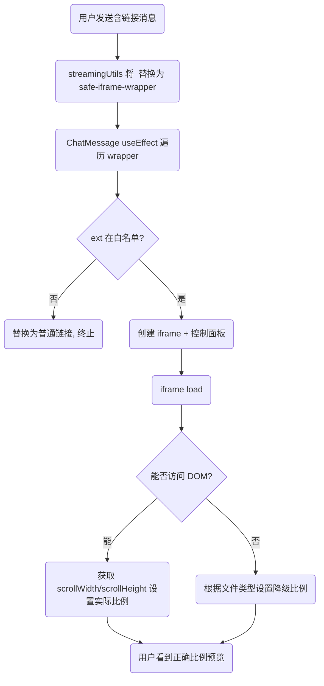

# Iframe 预览自适应比例方案设计

## 背景

目前 `safe-iframe-wrapper` 在 CSS 中使用固定高度 `300px`，导致不同尺寸/方向的文档（如竖版 PDF 简历或横版 PPT）在预览时出现空白区域或被压缩变形，影响阅读体验。

## 目标

1. **自动检测** 文档原始宽高比（可访问的同源资源）
2. **自适应容器** 根据检测结果或文件类别动态设置 `aspect-ratio`，保持原始比例
3. **响应式缩放**：在不同屏幕尺寸下，无论宽度如何变化，都能按正确比例缩放文档
4. **降级策略**：跨域或无法检测宽高比时，依据常见文档类型给出合理缺省比例

## 技术要点

### 1. CSS `aspect-ratio`
利用浏览器原生 `aspect-ratio` 属性，让容器根据宽度自动计算高度，无需 `padding-bottom hack`，代码更简洁。

### 2. 动态设置 `aspect-ratio`
在 `ChatMessage.tsx` 的 iframe 注入逻辑中：
1. **定义辅助函数** `applyAspectRatio(w, h)` 用于设置 `wrapper.style.aspectRatio = "w / h"` 并移除固定高度
2. 在 `iframe` 的 `load` 事件中尝试读取 `scrollWidth`、`scrollHeight` → 若成功则调用 `applyAspectRatio`
3. 失败时，根据扩展名降级：
   * PPT/Keynote → `16 / 9`
   * A4/简历类（PDF、DOC）→ `3 / 4`
   * 其他 → `1 / 1`

### 3. 跨域处理
对跨域资源浏览器不允许访问 `contentDocument`，因此检测将抛错。此时直接走降级比例，无需阻塞加载。

### 4. 默认样式调整
移除原先 `.safe-iframe-wrapper` 的 `h-[300px]`，改为默认 `aspect-ratio: 3 / 4`，并保持 `relative`、`overflow-hidden` 等属性。

## 方案流程

## 兼容性

`aspect-ratio` 已获得主流浏览器 (Chrome 88+, Edge 88+, Firefox 89+, Safari 14.1+) 广泛支持，满足项目最低浏览器要求。

## 风险与缓解
| 风险                        | 描述                           | 缓解措施                                                       |
| --------------------------- | ------------------------------ | -------------------------------------------------------------- |
| 浏览器不支持 `aspect-ratio` | 极少数旧版浏览器比例失效       | 保留最小高度 300px 的 Fallback 样式（inline style 覆盖时移除） |
| 获取 DOM 尺寸失败           | 某些同源 PDF 查看器返回 0 高度 | 增加失败检测，回退缺省比例                                     |

## 结论
该方案兼顾自动检测与合理降级，实现了"开箱即用、按原始比例"地预览静态文档，用户体验显著提升。 