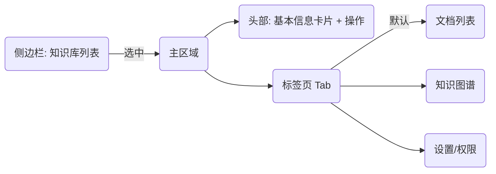
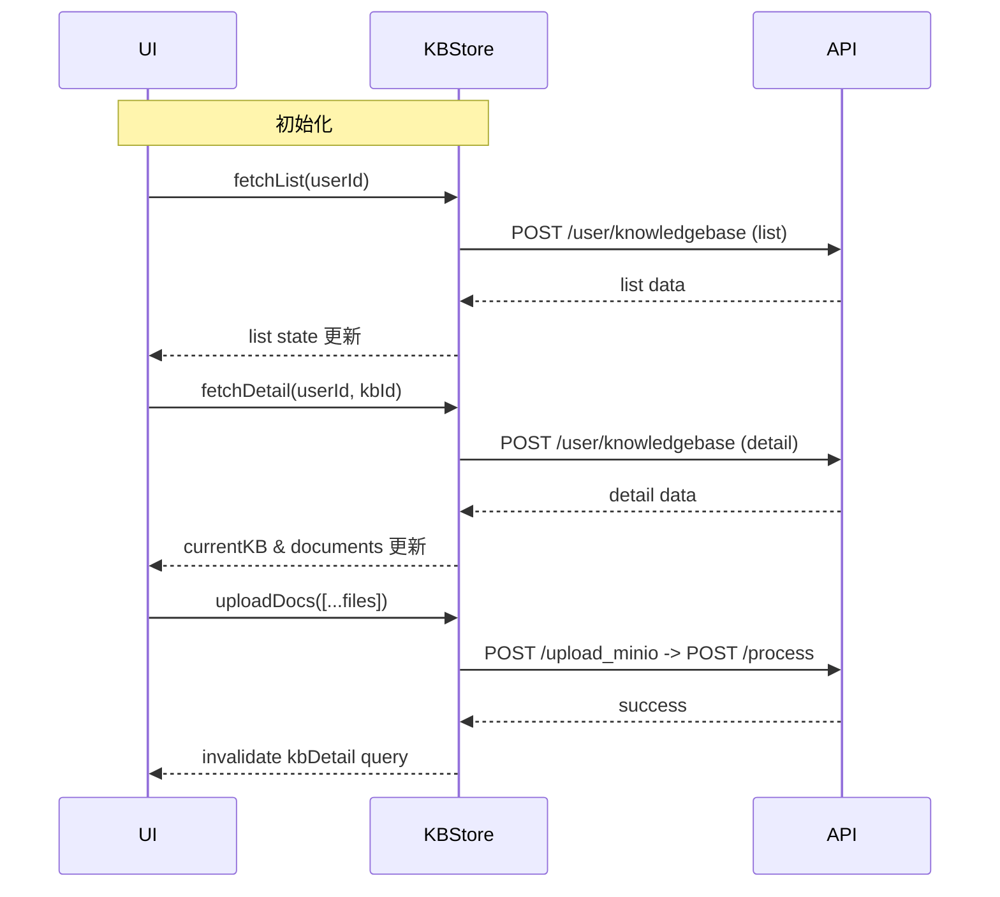
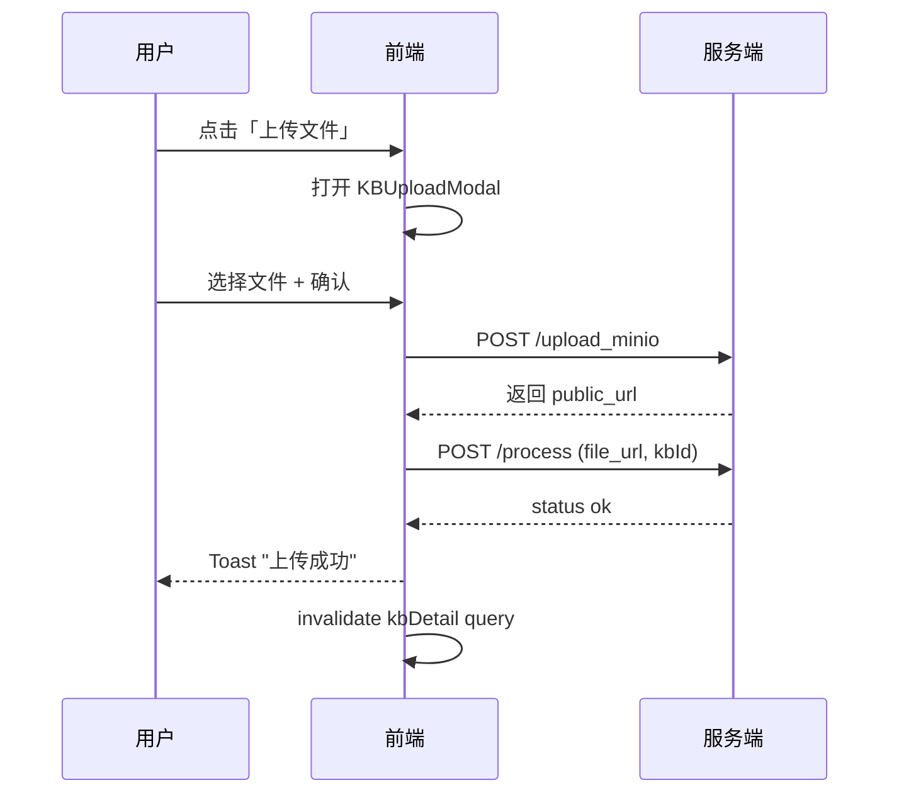

# 知识库页面重设计方案

## 1. 背景
当前知识库页面缺乏清晰的信息架构与交互逻辑，且未能充分利用后端 API 所提供的能力。本设计从零开始，依据现有 API 能力重新规划知识库相关功能与界面，为用户提供更高效、直观的知识管理体验。

## 2. 后端 API 能力梳理
### 2.1 知识库核心接口（服务端 8006）
| 功能            | HTTP                     | 必填字段                                           | 可选字段                                | 说明                                                                 |
| --------------- | ------------------------ | -------------------------------------------------- | --------------------------------------- | -------------------------------------------------------------------- |
| 创建/更新知识库 | POST /user/knowledgebase | mode=update、user_id、name                         | knowledgebase_id（更新时）、description | mode 字段推断出 *create* / *update* 两种行为                         |
| 获取知识库列表  | POST /user/knowledgebase | mode=get、user_id、target=list                     | —                                       | 返回每条记录的 id、name、description、document_count                 |
| 获取知识库详情  | POST /user/knowledgebase | mode=get、user_id、knowledgebase_id、target=detail | —                                       | 返回知识库基本信息及其 documents（包含 markdown_url、extra_info 等） |
| 删除知识库      | POST /user/knowledgebase | mode=delete、user_id、knowledgebase_id             | —                                       | 删除指定知识库                                                       |

### 2.2 文件与文档管理接口（服务端 8087）
| 功能                   | HTTP                          | 主要字段                                   | 说明                                              |
| ---------------------- | ----------------------------- | ------------------------------------------ | ------------------------------------------------- |
| 获取支持的文件格式     | GET /get_supported_file_types | —                                          | 返回前端可用来做上传校验的扩展名列表              |
| 上传文件并获取公网链接 | POST /upload_minio            | user_id, upload_file                       | 返回 public_url、file_id 等信息                   |
| 将文件加入知识库       | POST /process                 | user_id, file_url, knowledge_base_id, mode | mode=simple/normal；simple 为阻塞式处理并回传状态 |
| 删除文件               | POST /delete_file             | user_id, file_id, knowledge_base_id        | 从知识库移除文件                                  |

### 2.3 知识图谱接口
| 功能         | HTTP                       | 主要字段                                                 | 说明                                                  |
| ------------ | -------------------------- | -------------------------------------------------------- | ----------------------------------------------------- |
| 生成知识图谱 | POST /graph/knowledge_base | mode=produce, user_id, knowledge_base_id, level=document | 异步或同步生成 knowledge base 级别的文档节点+标签关系 |
| 获取知识图谱 | POST /graph/knowledge_base | mode=get, user_id, knowledge_base_id, level=document     | 获取已生成的图谱数据（document + tags）               |

### 2.4 端点间工作流
1. **创建知识库** → 返回 knowledgebase_id
2. **上传文件** → public_url → **存文件到知识库**(knowledge_base_id)
3. **生成/刷新知识图谱**(produce) → **获取知识图谱**(get)
4. **浏览知识库列表** → 点击项 → **拉取详情** → 展示文档列表 & 知识图谱

## 3. 数据模型
```ts
interface KnowledgeBaseSummary {
  id: string;
  name: string;
  description: string;
  document_count: number;
}

interface DocumentItem {
  id: string;
  name: string;
  description: string;
  markdown_url: string;
  extra_info: {
    type: string;
    size: number;
    created_at: string;
    updated_at: string;
  };
}

interface KnowledgeBaseDetail extends KnowledgeBaseSummary {
  documents: DocumentItem[];
}

interface KnowledgeGraph {
  documents: {
    id: string;
    name: string;
    tags: string[];
  }[];
}
```

## 4. 关键用户场景 & 交互流程
1. **浏览知识库**
   - 左侧列表展示用户全部知识库（summary）。
   - 选中后在右侧加载详情：基础信息、文档列表、知识图谱。
2. **创建/编辑知识库**
   - 顶部按钮触发弹窗，填写名称/描述，调用 create/update。
3. **上传文档到知识库**
   - 文档列表旁"上传"按钮 → 选择文件 → 检查扩展名（/get_supported_file_types）→ /upload_minio → /process。
4. **删除文档**
   - 文档行操作菜单"删除"→ /delete_file → 同步刷新列表。
5. **生成/刷新知识图谱**
   - 图谱区域含刷新按钮 → /graph/knowledge_base produce → 完成后自动 get 更新展示。
6. **删除知识库**
   - 列表项操作"删除"→ /user/knowledgebase delete → 同步移除。

## 5. 页面信息架构 & 布局


- **侧边栏**：可折叠、支持搜索、显示文档数量 badge。
- **主区域**：
  - 头部卡片：名称、描述、统计、编辑 / 删除按钮。
  - Tab 切换：文档 / 图谱 / 设置。
- **文档列表**：
  - 表格 + 分页 / 虚拟滚动；列：名称、描述、类型、大小、创建时间、操作。
- **知识图谱**：
  - 基于可视化库（如 react-flow / vis.js）渲染；支持缩放、拖拽、节点点击高亮。

## 6. 组件架构
| 组件              | 责任      | 依赖           | 备注                         |
| ----------------- | --------- | -------------- | ---------------------------- |
| KnowledgeBasePage | 顶层页面  | stores         | 负责数据加载、路由、权限判断 |
| KBListPanel       | 左侧列表  | useKBList()    | 支持搜索、新建、删除         |
| KBDetailHeader    | 详情头部  | props          | 展示信息、编辑弹窗           |
| KBTabView         | Tab 容器  | router state   | 文档/图谱/设置               |
| KBDocumentTable   | 文档列表  | useDocuments() | 上传/删除/预览               |
| KBUploadModal     | 上传文件  | useUpload()    | 步骤式（选择→上传→入库）     |
| KBGraphView       | 知识图谱  | useGraph()     | 生成/刷新/交互               |
| KBSettings        | 权限/配置 | —              | 预留                         |

## 7. 状态管理
- **knowledgeBaseStore**（Zustand）：
  - list: KnowledgeBaseSummary[]
  - currentKB: KnowledgeBaseDetail | null
  - graph: KnowledgeGraph | null
  - async actions: fetchList / fetchDetail / createOrUpdate / deleteKB / uploadDocs / deleteDoc / fetchGraph / produceGraph

## 8. 错误与边界处理
- 网络失败：全局 toast + 重试按钮。
- 上传文件大小/格式校验。
- 图谱生成异步耗时：loading spinner + 轮询或 WebSocket（如后端支持）。
- 知识库为空态：提示创建知识库并上传文档。

## 9. 技术栈建议
- UI 框架：Mantine 或 Ant Design（Tailwind +自定义亦可）。
- 图谱：react-force-graph / vis-network。
- 请求库：axios + React Query 处理缓存与状态。

## 10. 里程碑
1. API 端点梳理 ✅
2. 数据模型 & 状态管理
3. 页面信息架构 & 组件拆分
4. 交互原型 & 视觉稿
5. 开发实现
6. 测试 & 优化 

## 11. 数据模型 & 状态管理详细方案

### 11.1 本地 TypeScript 类型定义
```ts
// src/types/knowledgeBase.ts
export interface KBBase {
  id: string;
  name: string;
  description: string;
}

export interface KnowledgeBaseSummary extends KBBase {
  document_count: number;
}

export interface ExtraInfo {
  type: string;
  size: number;
  created_at: string;
  updated_at: string;
}

export interface DocumentItem {
  id: string;
  name: string;
  description: string;
  markdown_url: string;
  extra_info: ExtraInfo;
}

export interface KnowledgeBaseDetail extends KBBase {
  documents: DocumentItem[];
}

export interface GraphNode {
  id: string;
  name: string;
  tags: string[];
}

export interface KnowledgeGraph {
  documents: GraphNode[];
}
```

### 11.2 Zustand Store 结构
```ts
// src/stores/knowledgeBaseStore.ts
import { create } from 'zustand';
import {
  KnowledgeBaseSummary,
  KnowledgeBaseDetail,
  KnowledgeGraph,
  DocumentItem,
} from '../types/knowledgeBase';

interface State {
  list: KnowledgeBaseSummary[];
  currentKB: KnowledgeBaseDetail | null;
  graph: KnowledgeGraph | null;
  loading: boolean;
  error?: string;
  // actions
  fetchList(userId: string): Promise<void>;
  fetchDetail(userId: string, kbId: string): Promise<void>;
  createOrUpdate(params: {
    userId: string;
    kbId?: string;
    name: string;
    description: string;
  }): Promise<void>;
  deleteKB(userId: string, kbId: string): Promise<void>;
  uploadDocs(params: {
    userId: string;
    kbId: string;
    files: File[];
  }): Promise<void>;
  deleteDoc(params: {
    userId: string;
    kbId: string;
    docId: string;
  }): Promise<void>;
  produceGraph(userId: string, kbId: string): Promise<void>;
  fetchGraph(userId: string, kbId: string): Promise<void>;
}

export const useKnowledgeBaseStore = create<State>((set, get) => ({
  list: [],
  currentKB: null,
  graph: null,
  loading: false,
  async fetchList(userId) {
    // TODO 调用 /user/knowledgebase list 接口
  },
  async fetchDetail(userId, kbId) {
    // TODO 调用 detail 接口
  },
  async createOrUpdate(params) {
    // TODO 调用 create/update 接口
  },
  async deleteKB(userId, kbId) {
    // TODO 调用 delete 接口
  },
  async uploadDocs(params) {
    // TODO 调用 upload_minio & process
  },
  async deleteDoc(params) {
    // TODO 调用 delete_file
  },
  async produceGraph(userId, kbId) {
    // TODO 调用 graph produce
  },
  async fetchGraph(userId, kbId) {
    // TODO 调用 graph get
  },
}));
```

> 说明：为避免重复请求、共享缓存，可在上层结合 **React Query**：

| Query Key          | 数据                   | 失效时机          |
| ------------------ | ---------------------- | ----------------- |
| ["kbList", userId] | KnowledgeBaseSummary[] | 新建/删除知识库后 |
| ["kbDetail", kbId] | KnowledgeBaseDetail    | 文档上传/删除后   |
| ["kbGraph", kbId]  | KnowledgeGraph         | 生成图谱后        |

- **mutations**：createOrUpdate、deleteKB、uploadDocs、deleteDoc、produceGraph。
- 成功后使用 `queryClient.invalidateQueries` 精准刷新对应 key。

### 11.3 全局 Error & Loading 处理
1. Zustand 内 `loading` 字段提供同步 UI Spinner；
2. React Query hooks返回 `isLoading` / `isError` 状态；统一在 `App` 级别捕获并展示 Toast。

### 11.4 权限与并发
- 所有接口均需 `user_id`，在请求拦截器自动附加。
- 通过 [`AbortController`](https://developer.mozilla.org/zh-CN/docs/Web/API/AbortController) 取消重复的图谱生成请求。

### 11.5 本地缓存 & 乐观更新
- 删除知识库/文档时先在 **list/detail** 中立即移除，若接口失败则回滚。
- 上传文件队列以临时负 ID 渲染，成功后替换为真实文档信息。

### 11.6 与现有项目整合
- `chatStore`、`authStore` 保持不变；`knowledgeBaseStore` 独立管理 KB 相关状态。
- 在 `MainLayout` 注入 `KBListPanel` 的时候可通过 `useKnowledgeBaseStore` 读取 `list`。

---
上述方案补充了类型、zustand store 结构及 React Query 缓存策略，为后续组件开发提供明确的状态管理基础。 

## 12. 页面信息架构 & 组件拆分

### 12.1 顶层路由结构
```mermaid
graph TD
  app["/"] --> kb(KnowledgeBasePage)
  kb --> kbList[KBListPanel]
  kb --> kbMain[主内容区域]
  kbMain --> header[KBDetailHeader]
  kbMain --> tabs[KBTabView]
  tabs --> docs[KBDocumentTable]
  tabs --> graph[KBGraphView]
  tabs --> settings[KBSettings]
```

说明：
- `KnowledgeBasePage` 由 React Router 对应 `/knowledge-base` 路由。
- 当 `currentKB === null` 时，在主内容区域展示空态提示组件 `KBEmptyState`。

### 12.2 主要组件职责与交互
| 组件              | 关键 Props / State | 触发的 Action                                                           | 下游影响                           |
| ----------------- | ------------------ | ----------------------------------------------------------------------- | ---------------------------------- |
| KnowledgeBasePage | userId             | fetchList() on mount                                                    | list 更新后传递给 `KBListPanel`    |
| KBListPanel       | list, currentKBId  | onSelect(id) → fetchDetail                                              | 更新 currentKB + docs + graph      |
| KBDetailHeader    | currentKB          | onEdit → createOrUpdate                                                 | list & currentKB refresh           |
| KBTabView         | activeTab          | onTabChange                                                             | controls visible child             |
| KBDocumentTable   | documents          | onUpload → uploadDocs<br>onDelete → deleteDoc<br>onPreview → open modal | docs refresh (invalidate kbDetail) |
| KBUploadModal     | visible, kbId      | internally 执行 upload 流程                                             | 上传成功关闭并刷新 docs            |
| KBGraphView       | graph              | onRefresh → produceGraph → fetchGraph                                   | graph 更新后重新渲染               |
| KBSettings        | currentKB          | (预留)                                                                  | —                                  |

### 12.3 状态流向


### 12.4 空态 & 错误页
| 场景         | 组件               | 设计要点               |
| ------------ | ------------------ | ---------------------- |
| 无任何知识库 | KBEmptyState       | 引导按钮「新建知识库」 |
| 知识库无文档 | KBDocsEmpty        | 引导上传文件           |
| 图谱未生成   | KBGraphEmpty       | 提示点击「生成图谱」   |
| 网络错误     | 全局 ErrorBoundary | Toast + 重试           |

### 12.5 无障碍（A11y）
- 所有交互组件使用 `aria-*` 属性；
- 图谱支持键盘节点导航及放大缩小快捷键（+/-）。

### 12.6 性能优化
- 侧边栏列表 > 1000项时启用虚拟滚动（react-window）。
- 文档表格分页或虚拟列表。
- 图谱懒加载；第一次进入 `KBGraphView` 时才请求 `fetchGraph`。
- 使用 `useMemo` 缓存派生数据，如文档大小格式化等。

---
页面信息架构与组件拆分已完成，下一步将着手交互原型 & UI 视觉。 

## 13. 交互原型 & 视觉设计

> 本章节为低保真原型与视觉基线，便于后续在 Figma / Penpot 等工具中快速落地。

### 13.1 设计原则
1. 清晰层级：信息分区明显，避免用户迷失。
2. 任务导向：常用操作（新建、上传、刷新图谱）保持就近、显式可见。
3. 响应及时：所有异步操作提供 Loading & 成功/失败反馈。
4. 易用一致：组件复用统一样式与交互模式。

### 13.2 色彩体系 (符合 WCAG AA 对比度)
| 语义           | 颜色    | 用途                     |
| -------------- | ------- | ------------------------ |
| Primary        | #1664FF | 主按钮、链接、tab 激活色 |
| Primary Hover  | #3C7DFF | 鼠标悬浮                 |
| Success        | #14B65B | 操作成功提示             |
| Error          | #FF4D4F | 错误信息、删除危险操作   |
| Warning        | #FAAD14 | 删除确认弹窗 icon        |
| Text Primary   | #1F1F1F | 主要文字                 |
| Text Secondary | #595959 | 次要文字                 |
| Border         | #E5E6EB | 分割线、卡片边框         |
| Background     | #F7F8FA | 页面背景                 |
| Surface        | #FFFFFF | 卡片、侧边栏、表格背景   |

### 13.3 字体 & 排版
| 层级        | 字体大小/行高 | 字重 | 示例           |
| ----------- | ------------- | ---- | -------------- |
| H1 页面标题 | 24/32 px      | 600  | "我的知识库"   |
| H2 区块标题 | 18/28 px      | 600  | "文档列表"     |
| Body Large  | 16/24 px      | 400  | 列表主要信息   |
| Body        | 14/22 px      | 400  | 描述、表格内容 |
| Caption     | 12/18 px      | 400  | 标签、辅助信息 |

- 字体：'Inter', 'PingFang SC', sans-serif。
- 使用 `rem` 单位，根字号 16px。

### 13.4 间距 & 圆角
| Token         | 值                      |
| ------------- | ----------------------- |
| Spacing XS    | 4px                     |
| Spacing S     | 8px                     |
| Spacing M     | 16px                    |
| Spacing L     | 24px                    |
| Spacing XL    | 32px                    |
| Border Radius | 6px (按钮) / 8px (卡片) |

### 13.5 低保真页面草图
```mermaid
flowchart LR
  subgraph page[KnowledgeBasePage]
    direction TB
    sidebar[[侧边栏<br/>KBListPanel]]
    content[主内容区域]
  end
  sidebar -- 240px 固定宽度 --> content
  subgraph contentArea[ ]
    header[[KBDetailHeader\n名称+描述+按钮组]]
    tabs[[TabView<br/>Docs | Graph | Settings]]
    docsTbl[[KBDocumentTable]]
    graphView[[KBGraphView]]
    settingsView[[KBSettings]]
  end
  header --> tabs
  tabs --> docsTbl
  tabs --> graphView
  tabs --> settingsView
```

### 13.6 关键交互动效
| 场景         | 动效描述                                   | 时长  | 缓动        |
| ------------ | ------------------------------------------ | ----- | ----------- |
| Tab 切换     | 下划线滑动 & 内容淡入                      | 200ms | ease-out    |
| 文件上传成功 | 列表顶部插入新行，高亮背景渐变             | 800ms | ease-in-out |
| 生成图谱     | 按钮转为 loading spinner；完成后图谱区淡入 | 300ms | ease-out    |
| 删除行       | 行先压缩高度再淡出                         | 250ms | ease-in     |

### 13.7 组件示例—文档表格
| 列       | 对齐   | 宽度  | 说明                  |
| -------- | ------ | ----- | --------------------- |
| 文件名   | left   | 40%   | 可点击预览            |
| 类型     | center | 80px  | extra_info.type       |
| 大小     | center | 80px  | 格式化 MB             |
| 更新时间 | left   | 20%   | extra_info.updated_at |
| 操作     | center | 120px | 删除 / 下载           |

### 13.8 图谱节点样式
- 节点：圆角矩形，填充 Primary 10% 透明度。
- 文档名居中显示，最大宽度 160px，超出省略。
- 标签关系边：浅灰 #C2C8D6，hover 高亮 Primary。

### 13.9 响应式断点
| 断点       | 宽度    | 行为                                  |
| ---------- | ------- | ------------------------------------- |
| < 768px    | Mobile  | 侧边栏折叠为 Drawer；表格变为列表卡片 |
| 768–1200px | Tablet  | 侧边栏可折叠，表格横向滚动            |
| ≥ 1200px   | Desktop | 全功能展示                            |

### 13.10 交互流程原型（选取上传流程示例）


---
完成视觉基线后，可在 Figma 中依据以上 token & 结构快速出高保真稿，确保实现一致性。 